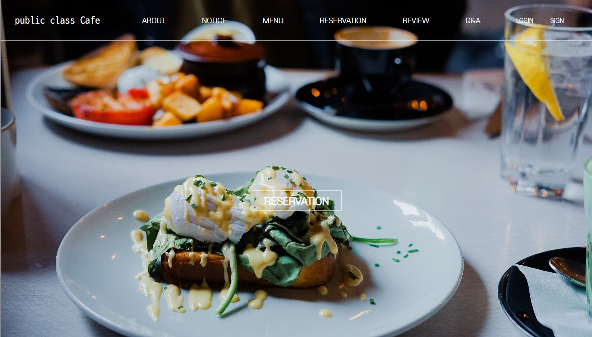

# cafe pcC

   
  
   

목차

## 프로젝트 소개

Model2 방식을 이용한 식당 예약 및 결제 사이트 구현

 

## 기술 스택

|   Java8   | JavaScript|   HTML5   |    CSS3   |  JQuery3  |  JSP2.4   |  MySQL8   |
| :-------: | :------: | :-------: | :--------: | :--------: | :--------: | :--------: | 
| ![java]   | ![js]     | ![html]   | ![css]    | ![jq]     | ![jsp]    | ![mysql]  |

 

## 구현 기능

### 기능 1
회원 : 회원가입, 로그인,회원정보 수정 및 탈퇴, 회원 전용 기능 제어  
매니저 : 매니저 로그인, 매니저 전용 기능 제어
### 기능 2
공지사항/리뷰/Q&A 게시판 글쓰기, 수정, 삭제 댓글 기능 구현
### 기능 3
예약 인원수에 따른 테이블 예약 및 예약 날짜 제어
### 기능 4
테이크 아웃 주문을 위한 메뉴 게시판, 장바구니, API 결제 시스템
 
  
## 배운 점 & 아쉬운 점

모든 팀원의 첫 프로젝트로, 전체적인 프로젝트의 흐름을 경험해볼 수 있었습니다. 
팀원들과의 소통, 명확한 의사 전달의 중요성을 깨닫게 되었습니다. 
수업 시간에 배운 내용을 직접 구현해서 적용해보는 즐거움을 느꼈습니다. 

카카오톡 로그인과 결제를 제외한 다른 API를 더 사용해보지 못해서 다음 프로젝트에서는 더욱 많은 API를 사용해보고 싶습니다. 

 

## 라이센스

MIT &copy; [NoHack](mailto:lbjp114@gmail.com)

<!-- Stack Icon Refernces -->

[java]: WebContent/img/icon/Java.png
[js]: WebContent/img/icon/JavaScript.png
[html]: WebContent/img/icon/html5.png
[css]: WebContent/img/icon/CSS3.png
[jq]: WebContent/img/icon/jQuery.png
[jsp]: WebContent/img/icon/JSP.png
[mysql]: WebContent/img/icon/mysql.jpg

